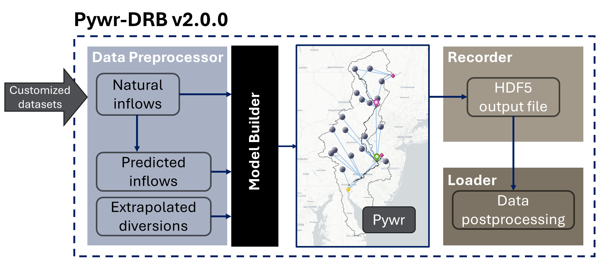

# Pywr-DRB Release Notes

## v2.0.0 (2025)
### Added
- 

### Changed
- 

### Fixed
- 

---

## v2.0.0 - beta (2025-05-28)
## Overview
Pywr-DRB v2.0.0 - beta is a pre-release version for a broader review before full v2.0.0 release. 

Pywr-DRB v2.0.0 - beta includes a major re-structure and modularization of the Pywr-DRB v1.0.2 (Hamilton et al., 2024), which emphasizes on improving the user interfaces for flexibility and ease of use. This version also greatly improves runtime efficiency and model fidelity by adding water temperature prediction and salt front location prediction capabilities while maintaining much of the core reservoir, diversion, regulatory and management functionality as the prior versions.

## Links and References
- [Pywr-DRB Repository](https://github.com/Pywr-DRB/Pywr-DRB)
- [Pywr-DRB Documentation](https://pywr-drb.github.io/Pywr-DRB/intro.html)
- [Pywr-DRB DOI ](https://doi.org/10.5281/zenodo.10720011)


## Major Updates

### 1. Modularization & Packaging
- Modularize the code and introduce new `pywrdrb` [API](https://pywr-drb.github.io/Pywr-DRB/api/api.html), relative to that used in Hamilton et al. (2024) seeks to:
	- Improve standardization (e.g., file naming conventions, workflows, docstrings)
	- Add flexibility for running simulations with different scenarios, settings and options
	- Improve runtime efficiency
	- Improve code reliability (e.g., unit testing and more detailed package dependency specifications)
    - Introduce object-oriented interface:
    ```python
    # v2.0.0 approach - object-oriented interface
    
    mb = pywrdrb.ModelBuilder(
        inflow_type='nhmv10_withObsScaled',
        start_date="2020-01-01",
        end_date="2020-12-31"
    )
    mb.make_model()
    mb.write_model("model.json")

    # Load model
    model = pywrdrb.Model.load("model.json")
    recorder = pywrdrb.OutputRecorder(
        model=model,
        output_filename=output_filename,
        parameters=[p for p in model.parameters if p.name]
        )

    # Execute the simulation
    stats = model.run()
    ```
- Adopts `pyproject.toml` to handle dependencies installation & package specifications that allows for simple `pip install pywrdrb`

- All of the data is now stored in a standardized format within [`Pywr-DRB/src/pywrdrb/data/`](https://github.com/Pywr-DRB/Pywr-DRB/tree/master/src/pywrdrb/data) 

#### Key modules & classes


- `DataPreprocessor classes`: 
    - Create necessary model inputs from the raw datasets (e.g., hydrological data).
    - Retrieve latest observed data (e.g., gauge flows and reservoir storages).
    - This module enable sustainable and customizable use of the model to run with latest information and user-provided inputs.
    
-  `pywrdrb.path_manager`: 
    - Adopt [`pathnavigator`](https://github.com/philip928lin/PathNavigator) for better path management that enable linking external custom datasets to pywrdrb.

- `pywrdrb.ModelBuilder`:
    - Modularize the model building process for customizing simulation settings.
    -    Write a model to JSON model file

- `pywrdrb.OutputRecorder`:
    - Enable subset output variables to reduce memory burden.
    - Improve runtime speed by avoiding frequent IO and utilizing internal memory.
    - This enable future large-scale experiments.
    
- `pywrdrb.Data`:
    - Convert internal variable names into user-friendly names.
    - Allow loading multiple output files 
    - Enable loading subset of outputs to enhance loading speed. 
    - This enable smooth comparison across simulation runs.

### 2. Improved policy representation with respect to Trenton flow target
- Pywr-DRB `v1.0.2` error incorrectly required NYC reservoirs to maintain the Trenton Equivalent Flow Objective at all times, which is inaccurate relative to the actual basin policy, which only requires NYC to maintain the Montague Flow Objective.
- Pywr-DRB `v2.0.0` correction: Implements the constrained Interim Excess Release Quantity (IERQ) Trenton flow bank as described by the [Flexible Flow Management Program](https://www.nj.gov/drbc/programs/flow/FFMP_PerformanceRpts.html); NYC reservoirs have an annual allocation of 6.09 billion gallons for the Trenton Equivalent Flow Objective.
	- NYC reservoirs are required to maintain only the Montague flow target, as specified by the [1954 US Supreme Court Decree.](https://supreme.justia.com/cases/federal/us/347/995/)
	- `IERQRelease` parameter (`pywrdrb/parameters/banks.py`) tracks bank usage and enforces constraints on NYC releases used for the Trenton Flow Objective. Bank resets each June 1st as specified in FFMP regulations
	   - In the latest version, we limit the annual NYC releases for Trenton to 6.02BG

### 3. Enabled water temperature & salt front location prediction capabilities
   - Added custom parameters to couple LSTM models with [`PywrDRB-ML`](github.com/philip928lin/PywrDRB-ML) plug-in to predict 1) daily maximum water temperature at Lordville and 2) 7-day averaged salt front location in river mile.
   - The [`PywrDRB-ML`](github.com/philip928lin/PywrDRB-ML) plug-in is currently private pending publication, but may be available upon request.

#### Designed LSTMs' capability
| Model           | From        | To   |
|-----------------|-------------|------|
| TempLSTM        | 1/1/1979    | 12/31/2023|
| SalinityLSTM    | 10/1/1963   | 12/31/2023|

#### Temperature LSTM model
- The temperature model is developed based on Zwart et al. (2023). In order to fit to the control purpose, we construct TempLSTM1 to predict the Cannonsville downstream gauge temperature (T_C) and TempLSTM2 to predict the East Branch flow and the natural flow to Lordville (T_i).
- The final water temperature at Lordville (T_L) is calculated by mapping the average temperature (Tavg) to the maximum temperature (T_L) using a random forest model.

#### Salinity LSTM model
- The Salinity LSTM model is developed based on Gorski et al. (2024). We rebuild the model using the LSTM and BMI sturcture derived from Zwart et al. (2023) to predict 7-day averaged salt front location in river mile at each timestep.
- Note that the salt front location has not yet be integrated into Montague and Trenton flow target operations.

### 4. Expanded number of pre-packaged streamflow scenarios
   - The original code used in Hamilton et al. (2024) only supported Pywr-DRB simulations using 4 hydrologic inflow datasets:
	   - NHM version 1.0
	   - NHM version 1.0 with scaled observational inflows at some reservoirs
	   - NWM version 2.1
	   - NWM version 2.1 with scaled observational inflows at some reservoirs
   - The latest version adds the following hydrologic inflow scenarios:
	   - WRF-Hydro simulated flow during the AORC period
	   - WRF-Hydro simulated flow during the AORC period with scaled observational inflows at some reservoirs
	   - WRF-Hydro simulated flow during the 1960s drought
	   - WRF-Hydro simulated flow during the 1960s drought, under a +2C climate scenario 
   - All of these inflow scenarios come pre-packaged with the `pywrdrb` source code, and are ready for simulation. The table below summarizes the scenarios, lists their scenario keys and provides their simulation periods.

| Scenario Key                    | Description                                        | Simulation Period         | Source                     | New to Pywr-DRB v2.0? |
| ------------------------------- | -------------------------------------------------- | ------------------------- | -------------------------- | --------------------- |
| `"nhmv10"`                      | National Hydrologic Model v1.0                     | 1983-10-01 to 2016-12-31  | Hay & LaFontain (2020)     | No                    |
| `"nhmv10_withObsScaled"`        | NHM v1.0 with scaled observations                  | 1983-10-01 to 2016-12-31  | Hamilton et al. (2024)     | No                    |
| `"nwmv21"`                      | National Water Model v2.1                          | 1983-10-01 to 2016-12-31  | Blodgett (2022)            | No                    |
| `"nwmv21_withObsScaled"`        | NWM v2.1 with scaled observations                  | 1983-10-01 to 2016-12-31  | Hamilton et al. (2024)     | No                    |
| `"wrfaorc_calib_nlcd2016"`      | WRF-Hydro AORC calibrated                          | 1979-10-01 to 2021-12-31  | NCAR^                     | Yes                   |
| `"wrfaorc_withObsScaled"`       | WRF-Hydro AORC calibrated with scaled Observations | 1979-10-01 to 2021-12-31  | NCAR^                      | Yes                   |
| `"wrf1960s_calib_nlcd2016"`     | WRF-Hydro 1960s drought                            | 1959-10-01 to 1969-12-31  | NCAR^                      | Yes                   |
| `"wrf2050s_calib_nlcd2016"`     | WRF-Hydro +2°C climate scenario                    | 1959-10-01 to 1969-12-31* | NCAR^                      | Yes                   |
| `"pub_nhmv10_BC_withObsScaled"` | Reconstructed streamflow (median)                          | 1945-01-01 to 2023-12-31  | Amestoy & Reed (In Review) | Yes                   |
* \^ National Center for Atmospheric Research. Publication unavailable.
* \* The `"wrf2050s_calib_nlcd2016"` scenario is meant to represent the drought of record (1960s) during a +2C warming scenario (2050). In the `pywrdrb` code, we adopt the 1959-1969 datetime index such that it is more easily compared to other simulation timeseries during the historic period.  

### 5 Added support for customized datasets
- The new code is designed to support custom streamflow datasets provided by the user. 
- This is done using the `pywrdrb.pre` module.
- Users must have a single CSV file with full natural flow estimates at all model nodes, and have them labeled using the node labels. 
- Then, we provide the `PredictedInflowPreprocessor` to generate supporting input data required for the simulation.
- See advanced tutorials for the detailed custom dataset workflows.

## References

Hamilton, A. L., Amestoy, T. J., & Reed, P. M. (2024). Pywr-DRB: An open-source Python model for water availability and drought risk assessment in the Delaware River Basin. Environmental Modelling & Software, 181, 106185. https://doi.org/10.1016/j.envsoft.2024.106185 

Amestoy, T. J. & Reed, P. M., (In Review) Integrated River Basin Assessment Framework Combining Probabilistic Streamflow Reconstruction, Bayesian Bias Correction, and Drought Storyline Analysis. Available at SSRN: https://ssrn.com/abstract=5240633 or http://dx.doi.org/10.2139/ssrn.5240633

Hay, L.E., and LaFontaine, J.H., 2020, Application of the National Hydrologic Model Infrastructure with the Precipitation-Runoff Modeling System (NHM-PRMS),1980-2016, Daymet Version 3 calibration: U.S. Geological Survey data release, https://doi.org/10.5066/P9PGZE0S.

Blodgett, D.L., 2022, National Water Model V2.1 retrospective for selected NWIS gage locations, (1979-2020): U.S. Geological Survey data release, https://doi.org/10.5066/P9K5BEJG.

Gorski, G., Cook, S., Snyder, A., Appling, A. P., Thompson, T., Smith, J. D., 
Warner, J. C., & Topp, S. N. (2024). Deep learning of estuary salinity dynamics is physically accurate at a fraction of hydrodynamic model computational cost. Limnology and Oceanography, 69(5), 1070–1085. https://doi.org/10.1002/lno.12549

Zwart, J. A., Oliver, S. K., Watkins, W. D., Sadler, J. M., Appling, A. P., Corson‐Dosch, H. R., ... & Read, J. S. (2023). Near‐term forecasts of stream temperature using deep learning and data assimilation in support of management decisions. JAWRA Journal of the American Water Resources Association, 59(2), 317-337.


---

## v1.0.2 (2024-8-04)
### Overview
- This release contains all code needed to create the analysis and figures in the following paper:

Hamilton, A.L., Amestoy, T.J., & P.M. Reed. (2024). Pywr-DRB: An open-source Python model for water availability and drought risk assessment in the Delaware River Basin. (In Review) Environmental Modeling and Software.

---