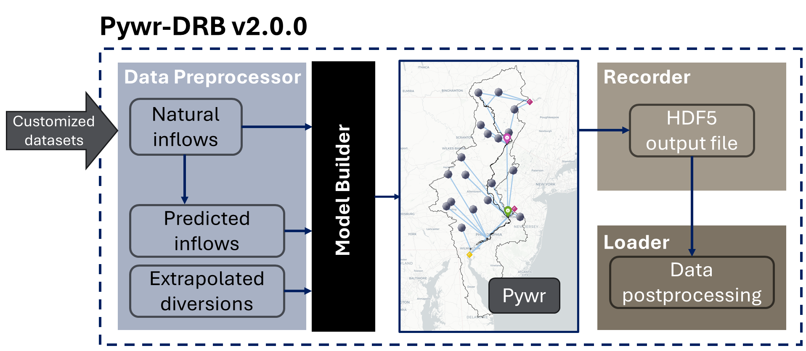

# Pywr-DRB Release Notes

## v2.2.0 - beta (2026-07-21)

## Overview

Pywr-DRB v2.2.0 adds a new `perfect_foresight` flow prediction mode, a new `STARFITOfflineSimulator` class which simulates STARFIT reservoir releases outside of the Pywr-DRB simulation, and the ability to run the model with custom STARFIT parameters. The pre-packaged observed flow and storage records have been extended through May 2026, with an improved NYC reservoir storage record. This release also contains bug fixes for ensemble simulations run using MPI.

## New Functionality

### 1. New `flow_prediction_mode` option in `ModelBuilder`

The FFMP-based release rules for the NYC and lower basin reservoirs rely on multi-day predictions of flows at Montague and Trenton. In prior versions, these predictions were always generated using a regression-based disaggregation method. This remains the default behavior.

The new `flow_prediction_mode` option in the `ModelBuilder` options allows the user to choose between prediction methods:

- `"regression_disagg"` (default): Regression-based flow predictions, identical to prior versions.
- `"perfect_foresight"`: Predictions constructed such that the model has perfect knowledge of future non-NYC flow contributions at Montague and Trenton. In this mode, NYC reservoirs contribute zero to the predicted flows (their releases are the quantity being determined by the FFMP logic), STARFIT-controlled reservoirs contribute pre-simulated STARFIT releases (see `STARFITOfflineSimulator` below), and all other nodes contribute their consumption-adjusted catchment inflows.

The legacy internal "perfect foresight" method, which took predictions directly from the dataset gage flows without accounting for reservoir operations, has been removed.

```python
import pywrdrb

mb = pywrdrb.ModelBuilder(
    start_date="1983-10-01",
    end_date="1985-12-31",
    inflow_type="nhmv10_withObsScaled",
    options={"flow_prediction_mode": "perfect_foresight"},
)
mb.make_model()
mb.write_model("./model_perfect_foresight.json")
```

#### 1.1 Regenerated `predicted_inflows_mgd.csv` and `predicted_diversions_mgd.csv`

The `predicted_inflows_mgd.csv` files for all nine pre-packaged datasets, and the `predicted_diversions_mgd.csv` file, have been re-generated and now contain both `regression_disagg` and `perfect_foresight` prediction columns. This allows users to run either prediction mode without re-running the preprocessors.

The `regression_disagg` predicted inflow values are unchanged relative to v2.1.0. The predicted diversions have been re-fit using the updated observed records (described below), so the regression-based diversion predictions differ from v2.1.0 and now extend through May 2025.

### 2. `STARFITOfflineSimulator` for offline reservoir simulation

The new `pywrdrb.pre.STARFITOfflineSimulator` class replicates the STARFIT release logic used by the `pywrdrb.parameters.STARFITReservoirRelease` parameter, but runs outside of the Pywr simulation. Given a timeseries of catchment inflows, it simulates storage dynamics and releases day-by-day for each STARFIT-controlled reservoir.

This class is used to generate the pre-simulated releases required by the `perfect_foresight` prediction mode. It can also be used on its own to study STARFIT release behavior for a given inflow scenario, without needing to run the full Pywr-DRB model.

```python
from pywrdrb.pre import STARFITOfflineSimulator

sim = STARFITOfflineSimulator(initial_volume_frac=0.8)
sim.load_parameters()
releases_df = sim.simulate_all(catchment_inflows_df)
```

### 3. Use custom STARFIT parameters

In prior versions, the STARFIT reservoir rule parameters were always loaded from the `istarf_conus.csv` file included in the package. The new `starfit_params_filename` option in the `ModelBuilder` options allows the user to provide an alternative STARFIT parameter CSV. The file must follow the same format as `istarf_conus.csv` and contain rows for all Pywr-DRB reservoirs. The custom parameters are used for both the reservoir capacities and the STARFIT release rules.

```python
mb = pywrdrb.ModelBuilder(
    start_date="1983-10-01",
    end_date="1985-12-31",
    inflow_type="nhmv10_withObsScaled",
    options={"starfit_params_filename": "./my_starfit_params.csv"},
)
```

Note that this option cannot be combined with the `run_starfit_sensitivity_analysis` option, which loads parameters from a separate scenario file.

<!-- Section 4: updated default STARFIT parameters in istarf_conus.csv; to be added before release. -->

## Updated Observed Data Records

The pre-packaged observed data records (`gage_flow_mgd.csv`, `catchment_inflow_mgd.csv`, `reservoir_storage_mg.csv`) have been re-generated and now extend through 2026-05-04.

The NYC reservoir storage records (`cannonsville`, `pepacton`, `neversink`) have been improved:

- DRBC daily storage records are now used for the period 1999-12-01 through 2021-11-30, replacing the storage values derived from USGS elevation records over that period. USGS-derived values are still used outside of the DRBC record period.
- Early-record storage values known to be erroneous are now dropped on a per-reservoir basis, using reservoir-specific validity start dates.
- The retrieval workflow (`pywrdrb.pre.ObservationalDataRetriever`) now exports an audit CSV of the USGS-derived NYC storage record, and includes a storage diagnostics plotting function for visual inspection of the merged record.

New tests have been added in `tests/test_observation_loader.py` to verify the merged NYC storage record.

## Bug Fixes

### 1. Fixed scenario indexing in ensemble simulations

Some parameters were indexing scenario data using the local scenario index rather than `scenario_index.global_id`. This produced incorrect scenario mappings when running ensemble simulations with MPI, where each rank only sees a subset of scenarios. The affected parameters, including `STARFITReservoirRelease` and the lower basin FFMP parameters, now use `global_id` throughout.

### 2. Fixed ensemble realization ID handling in preprocessors

The ensemble preprocessors were inconsistent in their handling of integer vs. string realization IDs when reading ensemble HDF5 files, which caused failures for some ensemble datasets. Realization IDs are now consistently coerced to strings. The ensemble preprocessors also now accept an optional `comm` argument, allowing an existing MPI communicator to be reused.

### 3. STARFIT releases now enforce the minimum release in all storage conditions

Previously, the `STARFITReservoirRelease` parameter only enforced the minimum release (`R_min`) when storage was below the normal operating range. When storage was inside the NOR, the release function could dip below `R_min` on very dry days. The minimum release is now enforced in all storage conditions, consistent with the DRBC conservation release requirements at the lower basin reservoirs.

The practical impact is small: in a 40-year test simulation, this affected roughly 0.27% of days at Blue Marsh (the most affected reservoir), with all other days unchanged. The same correction is applied in the `STARFITOfflineSimulator`.

---

## v2.1.0

## Bug Fixes

### 1. Fixed bug in `PredictedInflowPreprocessor`

Starting in Pywr-DRB v2.0.0, we include the `pywrdrb.pre.PredictedInflowPreprocessor()` class. This is designed to flexibly support inflow prediction for any custom dataset. 

This class contained a bug which was previously resulting in predicted flows being much less than the actual modeled flows at Trenton.  As a result, the model was over-compensating and Blue Marsh and Beltzville reservoirs were releasing un-necessary water toward Trenton. 

This bug has been fixed in the latest version. 

#### 1.1 Fixed `predicted_inflows_mgd.csv` for certain pre-packaged datasets

Due to the bug described above, a few of the pre-packaged datasets which were new to version 2.0.0 included faulty input data for the `predicted_inflow_mgd.csv`. 

This bug affected the following datasets:
- `pub_nhmv10_BC_withObsScaled` (with package installation)
- All `wrf*` datasets (with package installation)


The `predicted_inflow_mgd.csv` for each of these datasets has been re-generated using the revised `PredictedInflowPreprocessor`, and the correct values are now included in the package installation.

### 2. Fixed lower basin release accounting for Trenton flow target

Lower basin reservoirs (beltzville, blue marsh, nockamixon) are used to help support the Trenton equivalent flow target with additional releases. 

In prior versions of the model, these reservoirs were releasing excessive volumes to support Trenton flows, even when they were not necessary. 

This was a bug located in the `pywrdrb.parameters.ffmp.TotalReleaseNeededForDownstreamMRF` parameter which was not considering prior lower basin releases when determining the remaining contribution requirements.  This new version improves the accounting and helps avoid unnecessary releases. 


## Improved Trenton Equivalent Flow Calculation

This new version includes a more accurate representation of the "Trenton Equivalent Flow". 

> "The Trenton Equivalent Flow is computed as the sum of flows at the USGS Trenton gaging station, releases in excess of conservation releases from Blue Marsh Reservoir, and an amount of water, determined by the Delaware River Basin Commission (DRBC), to account for bypass flows via Yardley and the Point Pleasant Pumping Station." (2017 FFMP Section 2.b)

In prior versions of the model, the Trenton Equivalent Flow was calculated as: Total flow at Trenton gauge + Blue Marsh reservoir releases beyond the normal, STARFIT-based releases.  

In the revised model, the Trenton Equivalent Flow is calculated as: Total flow at Trenton gauge + Blue Marsh releases above the conservation release value (50 cfs) 


## Updated ML temperature and salinity modeling capabilities

Improved API and functionality for the LSTM temperature and salinity models. 

A new tutorial notebook will be available soon. 

## New Functionality

### Use custom diversion data

In prior versions of the model, there was only a single historical diversion dataset available. This restricted simulation to the historic period, since future diversions were not available. Additionally, the user could not use any alternative diversion other than the single historic data.

In the new version, we allow for custom diversions when running custom inflow scenarios.

The custom diversions can either be manually generated or generated using the preprocessor described below.

#### `ExtrapolatedDiversionPreprocessor` to generate for custom diversion data


A new tutorial notebook demonstrating this functionality will be available soon.


In the ModelBuilder options, there is a new option `nyc_nj_demand_data` which can take values ['historic', 'custom', 'constant'].  When 


### `PredictedDiversionEnsemblePreprocessor` to support custom inflow ensemble simulation

The `PredictedDiversionPreprocessor` is needed when running custom inflow scenarios.  However, prior versions only supporting single-scenario datasets.  This prevented the use of custom inflow _ensemble_ data from being used. 

The new `PredictedDiversionEnsemblePreprocessor` allows for ensembles of custom inflow to be run using Pywr-DRB. 


---

## v2.0.1
## Overview

Pywr-DRB v2.0.1 adds package dependency versions to avoid installation issues, and contains minor bug fixes with the `pywrdrb.Data()` class functionality.

## Package Dependencies

Recent updates to the `pywr` and `scipy` packages cause issues during installation.  

We have updated the `pywrdrb` dependency list to include:
- `"pywr==1.27.4"`
- `"scipy==1.15.3"`

We specify versions across the dependency list, however the only necessary version requirements at the moment are for the two packages above. 

## Minor Bug Fixes and Updates

### `pywrdrb.Data()` Updates

- Modified the `AbstractDataLoader` class to support ensemble flow files in `AbstractDataLoader.get_base_results()
	- Previously, this only supported loading data from `gage_flow_mgd.csv` files
	- Now, it supports ensemble files (`gage_flow_mgd.hdf5`) for a list of `realization_ids`
- Moved the `flowtye_opts` list creation into the `__init__()` of the `HydrologicModelFlow()` class.  This is necessary to allow for custom inflow types to be recognized as a valid flowtype option when using:
	- `pywrdrb.Data().load_hydrologic_model_flow()`
	- User's are still required to register the custom flowtype using the `pathnavigator` as demonstrated in [Tutorial 04 - Using Customized Data to Run Pywr-DRB](https://pywr-drb.github.io/Pywr-DRB/examples/Tutorial%2004%20Using%20Customized%20Data%20To%20Run%20Model.html)
- Added `"all"` to the `hydrologic_model_results_set_opts`
	- This allows uses to load flows from all nodes (instead of just major_nodes) when running `pywrdrb.Data().load_hydrologic_model_flow()`
- Modified the `pywrdrb.Data().export()` and `pywrdrb.Data().load_from_export()` to support custom data.
	- Previously, these functions only allowed for export/load of existing `results_set` options.
	- Now, users can add new/custom data to the `pywrdrb.Data` object, then export and re-load that data later. 
	- See the example


## Example: Modifying, exporting and re-loading data objects

Below is an example of how custom/new data can be added to the `pywrdrb.Data` class, and how the full data class can be exported to a new file and later reloaded. 

First, load the Pywr-DRB output using the existing `pywrdrb.Data` functionality.  See [Tutorial 03 - Loading and Interpreting Output](https://pywr-drb.github.io/Pywr-DRB/examples/Tutorial%2003%20Load%20Results.html) for more detail on this existing functionality.
```python
## Existing functionality
import pywrdrb
data = pywrdrb.Data()
data.load_output(
    results_sets=['major_flow'],
    output_filenames=['./pywrdrb_output.hdf5']
)
df_flow = data.major_flow["pywrdrb_output"][0]
```

We can calculate new data using the loaded output data. In this example below, I'll do a simple 7-day mean flow calculation.

Then, we can store the newly calculated `rolling_mean_major_flow` inside the data object. Importantly, this addition must match the hierarchical data dictionary formatting. 

After the data is stored in the `data` object, we can use the `export()` function. 

The export function will save all attributes/contents of the `data` object to an HDF5 file with the given name. 

```python
## New functionality
# Calculate new metrics based on the original output data
df_flow_rolling = df_flow.rolling(window=7).mean()

# Store the new df in the data object
# Important: Format of dictionaries must match
data.rolling_mean_major_flow = {}
data.rolling_mean_major_flow["pywrdrb_output"] = {}
data.rolling_mean_major_flow["pywrdrb_output"][0] = df_flow_rolling

# Save the full data object as an export
# This will include all metrics, including the added rolling mean flow
data.export("./pywrdrb_output_with_postprocessing.hdf5")
```

Then, later we can re-load the modified data object using:

```python
data = pywrdrb.Data()
data.load_from_export("./pywrdrb_output_with_postprocessing.hdf5")
```

## Example: Loading custom hydrologic data using `pywrdrb.Data()`

The `load_hydrologic_model_flow()` function is designed to load `<flowtype>/gage_flow_mgd.csv` files.  Thus, the resulting data is reflective of the full natural flow as modeled by the model/dataset being loaded. This flow is _not_ routed through Pywr-DRB.

Previously, this funciton was unable to be used for custom `flowtypes` arguments, and was only able to load the datasets that came pre-packaged with `pywrdrb` installation.  

The 2.0.1 patch fixes this, as shown below.

Importantly, this assumes that the custom data `csv` file has the same formatting as the existing pywrdrb datasets (node names as column names and datetime index) which is generally a pre-requisit for using custom data in the pywrdrb modeling workflow. 

```python
# Register custom dataset with pathnavigator
pn_config = pywrdrb.get_pn_config()
pn_config["flows/custom_data"] = "custom_data"
pywrdrb.load_pn_config(pn_config)

# List of result types to load
# these include all valid options given the input data
results_sets=['all', 'major_flow', 'reservoir_downstream_gage']

data = pywrdrb.Data()

# Previously, using flowtypes=['custom_data'] would give error
data.load_hydrologic_model_flow(flowtypes=["custom_data"],
                                results_sets=results_sets)

# The "all" results set is new, and returns gage_flow (full natural) at all nodes
data.all['custom_data'][0].head()
```


---

## v2.0.0 (2025)
## Overview

Pywr-DRB v2.0.0 includes a major re-structure and modularization of the Pywr-DRB v1.0.2 (Hamilton et al., 2024), which emphasizes on improving the user interfaces for flexibility and ease of use. This version also greatly improves runtime efficiency and model fidelity by adding water temperature prediction and salt front location prediction capabilities while maintaining much of the core reservoir, diversion, regulatory and management functionality as the prior versions.

Please cite the release as

Lin, C.Y., Amestoy, T., Smith, M., Hamilton, A., & Reed, P. (2025). Pywr‑DRB v2.0.0 [Software]. Zenodo. https://doi.org/10.5281/zenodo.15659955

## Links and References
- [Pywr-DRB Repository](https://github.com/Pywr-DRB/Pywr-DRB)
- [Pywr-DRB Documentation](https://pywr-drb.github.io/Pywr-DRB/intro.html)
- [Pywr-DRB DOI ](https://doi.org/10.5281/zenodo.10720011)


## Major Updates

### 1. Modularization & Packaging
- Modularize the code and introduce new `pywrdrb` [API](https://pywr-drb.github.io/Pywr-DRB/api/api.html), relative to that used in Hamilton et al. (2024) seeks to:
	- Improve standardization (e.g., file naming conventions, workflows, docstrings)
	- Add flexibility for running simulations with different scenarios, settings and options
	- Improve runtime efficiency
	- Improve code reliability (e.g., unit testing and more detailed package dependency specifications)
    - Introduce object-oriented interface:
    ```python
    # v2.0.0 approach - object-oriented interface
    
    mb = pywrdrb.ModelBuilder(
        inflow_type='nhmv10_withObsScaled',
        start_date="2020-01-01",
        end_date="2020-12-31"
    )
    mb.make_model()
    mb.write_model("model.json")

    # Load model
    model = pywrdrb.Model.load("model.json")
    recorder = pywrdrb.OutputRecorder(
        model=model,
        output_filename=output_filename,
        parameters=[p for p in model.parameters if p.name]
        )

    # Execute the simulation
    stats = model.run()
    ```
- Adopts `pyproject.toml` to handle dependencies installation & package specifications that allows for simple `pip install pywrdrb`

- All of the data is now stored in a standardized format within [`Pywr-DRB/src/pywrdrb/data/`](https://github.com/Pywr-DRB/Pywr-DRB/tree/master/src/pywrdrb/data) 

#### Key modules & classes


- `DataPreprocessor classes`: 
    - Create necessary model inputs from the raw datasets (e.g., hydrological data).
    - Retrieve latest observed data (e.g., gauge flows and reservoir storages).
    - This module enable sustainable and customizable use of the model to run with latest information and user-provided inputs.
    
-  `pywrdrb.path_manager`: 
    - Adopt [`pathnavigator`](https://github.com/philip928lin/PathNavigator) for better path management that enable linking external custom datasets to pywrdrb.

- `pywrdrb.ModelBuilder`:
    - Modularize the model building process for customizing simulation settings.
    -    Write a model to JSON model file

- `pywrdrb.OutputRecorder`:
    - Enable subset output variables to reduce memory burden.
    - Improve runtime speed by avoiding frequent IO and utilizing internal memory.
    - This enable future large-scale experiments.
    
- `pywrdrb.Data`:
    - Convert internal variable names into user-friendly names.
    - Allow loading multiple output files 
    - Enable loading subset of outputs to enhance loading speed. 
    - This enable smooth comparison across simulation runs.

### 2. Improved policy representation with respect to Trenton flow target
- Pywr-DRB `v1.0.2` error incorrectly required NYC reservoirs to maintain the Trenton Equivalent Flow Objective at all times, which is inaccurate relative to the actual basin policy, which only requires NYC to maintain the Montague Flow Objective.
- Pywr-DRB `v2.0.0` correction: Implements the constrained Interim Excess Release Quantity (IERQ) Trenton flow bank as described by the [Flexible Flow Management Program](https://www.nj.gov/drbc/programs/flow/FFMP_PerformanceRpts.html); NYC reservoirs have an annual allocation of 6.09 billion gallons for the Trenton Equivalent Flow Objective.
	- NYC reservoirs are required to maintain only the Montague flow target, as specified by the [1954 US Supreme Court Decree.](https://supreme.justia.com/cases/federal/us/347/995/)
	- `IERQRelease` parameter (`pywrdrb/parameters/banks.py`) tracks bank usage and enforces constraints on NYC releases used for the Trenton Flow Objective. Bank resets each June 1st as specified in FFMP regulations
	   - In the latest version, we limit the annual NYC releases for Trenton to 6.02BG

### 3. Enabled water temperature & salt front location prediction capabilities
   - Added custom parameters to couple LSTM models with [`PywrDRB-ML`](github.com/philip928lin/PywrDRB-ML) plug-in to predict 1) daily maximum water temperature at Lordville and 2) 7-day averaged salt front location in river mile.
   - The [`PywrDRB-ML`](github.com/philip928lin/PywrDRB-ML) plug-in is currently private pending publication, but may be available upon request.

#### Designed LSTMs' capability
| Model           | From        | To   |
|-----------------|-------------|------|
| TempLSTM        | 1/1/1979    | 12/31/2023|
| SalinityLSTM    | 10/1/1963   | 12/31/2023|

#### Temperature LSTM model
- The temperature model is developed based on Zwart et al. (2023). In order to fit to the control purpose, we construct TempLSTM1 to predict the Cannonsville downstream gauge temperature (T_C) and TempLSTM2 to predict the East Branch flow and the natural flow to Lordville (T_i).
- The final water temperature at Lordville (T_L) is calculated by mapping the average temperature (Tavg) to the maximum temperature (T_L) using a random forest model.
- Introduce API to allow user input thermal control policy

#### Salinity LSTM model
- The Salinity LSTM model is developed based on Gorski et al. (2024). We rebuild the model using the LSTM and BMI sturcture derived from Zwart et al. (2023) to predict 7-day averaged salt front location in river mile at each timestep.
- Note that the salt front location has not yet be integrated into Montague and Trenton flow target operations. It is scheduled in the next release.

### 4. Expanded number of pre-packaged streamflow scenarios
   - The original code used in Hamilton et al. (2024) only supported Pywr-DRB simulations using 4 hydrologic inflow datasets:
	   - NHM version 1.0
	   - NHM version 1.0 with scaled observational inflows at some reservoirs
	   - NWM version 2.1
	   - NWM version 2.1 with scaled observational inflows at some reservoirs
   - The latest version adds the following hydrologic inflow scenarios:
	   - WRF-Hydro simulated flow during the AORC period
	   - WRF-Hydro simulated flow during the AORC period with scaled observational inflows at some reservoirs
	   - WRF-Hydro simulated flow during the 1960s drought
	   - WRF-Hydro simulated flow during the 1960s drought, under a +2C climate scenario 
   - All of these inflow scenarios come pre-packaged with the `pywrdrb` source code, and are ready for simulation. The table below summarizes the scenarios, lists their scenario keys and provides their simulation periods.

| Scenario Key                    | Description                                        | Simulation Period         | Source                     | New to Pywr-DRB v2.0? |
| ------------------------------- | -------------------------------------------------- | ------------------------- | -------------------------- | --------------------- |
| `"nhmv10"`                      | National Hydrologic Model v1.0                     | 1983-10-01 to 2016-12-31  | Hay & LaFontain (2020)     | No                    |
| `"nhmv10_withObsScaled"`        | NHM v1.0 with scaled observations                  | 1983-10-01 to 2016-12-31  | Hamilton et al. (2024)     | No                    |
| `"nwmv21"`                      | National Water Model v2.1                          | 1983-10-01 to 2016-12-31  | Blodgett (2022)            | No                    |
| `"nwmv21_withObsScaled"`        | NWM v2.1 with scaled observations                  | 1983-10-01 to 2016-12-31  | Hamilton et al. (2024)     | No                    |
| `"wrfaorc_calib_nlcd2016"`      | WRF-Hydro AORC calibrated                          | 1979-10-01 to 2021-12-31  | NCAR^                     | Yes                   |
| `"wrfaorc_withObsScaled"`       | WRF-Hydro AORC calibrated with scaled Observations | 1979-10-01 to 2021-12-31  | NCAR^                      | Yes                   |
| `"wrf1960s_calib_nlcd2016"`     | WRF-Hydro 1960s drought                            | 1959-10-01 to 1969-12-31  | NCAR^                      | Yes                   |
| `"wrf2050s_calib_nlcd2016"`     | WRF-Hydro +2°C climate scenario                    | 1959-10-01 to 1969-12-31* | NCAR^                      | Yes                   |
| `"pub_nhmv10_BC_withObsScaled"` | Reconstructed streamflow (median)                          | 1945-01-01 to 2023-12-31  | Amestoy & Reed (In Review) | Yes                   |
* \^ National Center for Atmospheric Research. Publication unavailable.
* \* The `"wrf2050s_calib_nlcd2016"` scenario is meant to represent the drought of record (1960s) during a +2C warming scenario (2050). In the `pywrdrb` code, we adopt the 1959-1969 datetime index such that it is more easily compared to other simulation timeseries during the historic period.  

### 5 Added support for customized datasets
- The new code is designed to support custom streamflow datasets provided by the user. 
- This is done using the `pywrdrb.pre` module.
- Users must have a single CSV file with full natural flow estimates at all model nodes, and have them labeled using the node labels. 
- Then, we provide the `PredictedInflowPreprocessor` to generate supporting input data required for the simulation.
- See advanced tutorials for the detailed custom dataset workflows.

## References

Hamilton, A. L., Amestoy, T. J., & Reed, P. M. (2024). Pywr-DRB: An open-source Python model for water availability and drought risk assessment in the Delaware River Basin. Environmental Modelling & Software, 181, 106185. https://doi.org/10.1016/j.envsoft.2024.106185 

Amestoy, T. J. & Reed, P. M., (In Review) Integrated River Basin Assessment Framework Combining Probabilistic Streamflow Reconstruction, Bayesian Bias Correction, and Drought Storyline Analysis. Available at SSRN: https://ssrn.com/abstract=5240633 or http://dx.doi.org/10.2139/ssrn.5240633

Hay, L.E., and LaFontaine, J.H., 2020, Application of the National Hydrologic Model Infrastructure with the Precipitation-Runoff Modeling System (NHM-PRMS),1980-2016, Daymet Version 3 calibration: U.S. Geological Survey data release, https://doi.org/10.5066/P9PGZE0S.

Blodgett, D.L., 2022, National Water Model V2.1 retrospective for selected NWIS gage locations, (1979-2020): U.S. Geological Survey data release, https://doi.org/10.5066/P9K5BEJG.

Gorski, G., Cook, S., Snyder, A., Appling, A. P., Thompson, T., Smith, J. D., 
Warner, J. C., & Topp, S. N. (2024). Deep learning of estuary salinity dynamics is physically accurate at a fraction of hydrodynamic model computational cost. Limnology and Oceanography, 69(5), 1070–1085. https://doi.org/10.1002/lno.12549

Zwart, J. A., Oliver, S. K., Watkins, W. D., Sadler, J. M., Appling, A. P., Corson‐Dosch, H. R., ... & Read, J. S. (2023). Near‐term forecasts of stream temperature using deep learning and data assimilation in support of management decisions. JAWRA Journal of the American Water Resources Association, 59(2), 317-337.

---

## v2.0.0 - beta (2025-05-28)
## Overview
Pywr-DRB v2.0.0 - beta is a pre-release version for a broader review before full v2.0.0 release. 

Pywr-DRB v2.0.0 - beta includes a major re-structure and modularization of the Pywr-DRB v1.0.2 (Hamilton et al., 2024), which emphasizes on improving the user interfaces for flexibility and ease of use. This version also greatly improves runtime efficiency and model fidelity by adding water temperature prediction and salt front location prediction capabilities while maintaining much of the core reservoir, diversion, regulatory and management functionality as the prior versions.

## Links and References
- [Pywr-DRB Repository](https://github.com/Pywr-DRB/Pywr-DRB)
- [Pywr-DRB Documentation](https://pywr-drb.github.io/Pywr-DRB/intro.html)
- [Pywr-DRB DOI ](https://doi.org/10.5281/zenodo.10720011)


## Major Updates

### 1. Modularization & Packaging
- Modularize the code and introduce new `pywrdrb` [API](https://pywr-drb.github.io/Pywr-DRB/api/api.html), relative to that used in Hamilton et al. (2024) seeks to:
	- Improve standardization (e.g., file naming conventions, workflows, docstrings)
	- Add flexibility for running simulations with different scenarios, settings and options
	- Improve runtime efficiency
	- Improve code reliability (e.g., unit testing and more detailed package dependency specifications)
    - Introduce object-oriented interface:
    ```python
    # v2.0.0 approach - object-oriented interface
    
    mb = pywrdrb.ModelBuilder(
        inflow_type='nhmv10_withObsScaled',
        start_date="2020-01-01",
        end_date="2020-12-31"
    )
    mb.make_model()
    mb.write_model("model.json")

    # Load model
    model = pywrdrb.Model.load("model.json")
    recorder = pywrdrb.OutputRecorder(
        model=model,
        output_filename=output_filename,
        parameters=[p for p in model.parameters if p.name]
        )

    # Execute the simulation
    stats = model.run()
    ```
- Adopts `pyproject.toml` to handle dependencies installation & package specifications that allows for simple `pip install pywrdrb`

- All of the data is now stored in a standardized format within [`Pywr-DRB/src/pywrdrb/data/`](https://github.com/Pywr-DRB/Pywr-DRB/tree/master/src/pywrdrb/data) 

#### Key modules & classes


- `DataPreprocessor classes`: 
    - Create necessary model inputs from the raw datasets (e.g., hydrological data).
    - Retrieve latest observed data (e.g., gauge flows and reservoir storages).
    - This module enable sustainable and customizable use of the model to run with latest information and user-provided inputs.
    
-  `pywrdrb.path_manager`: 
    - Adopt [`pathnavigator`](https://github.com/philip928lin/PathNavigator) for better path management that enable linking external custom datasets to pywrdrb.

- `pywrdrb.ModelBuilder`:
    - Modularize the model building process for customizing simulation settings.
    -    Write a model to JSON model file

- `pywrdrb.OutputRecorder`:
    - Enable subset output variables to reduce memory burden.
    - Improve runtime speed by avoiding frequent IO and utilizing internal memory.
    - This enable future large-scale experiments.
    
- `pywrdrb.Data`:
    - Convert internal variable names into user-friendly names.
    - Allow loading multiple output files 
    - Enable loading subset of outputs to enhance loading speed. 
    - This enable smooth comparison across simulation runs.

### 2. Improved policy representation with respect to Trenton flow target
- Pywr-DRB `v1.0.2` error incorrectly required NYC reservoirs to maintain the Trenton Equivalent Flow Objective at all times, which is inaccurate relative to the actual basin policy, which only requires NYC to maintain the Montague Flow Objective.
- Pywr-DRB `v2.0.0` correction: Implements the constrained Interim Excess Release Quantity (IERQ) Trenton flow bank as described by the [Flexible Flow Management Program](https://www.nj.gov/drbc/programs/flow/FFMP_PerformanceRpts.html); NYC reservoirs have an annual allocation of 6.09 billion gallons for the Trenton Equivalent Flow Objective.
	- NYC reservoirs are required to maintain only the Montague flow target, as specified by the [1954 US Supreme Court Decree.](https://supreme.justia.com/cases/federal/us/347/995/)
	- `IERQRelease` parameter (`pywrdrb/parameters/banks.py`) tracks bank usage and enforces constraints on NYC releases used for the Trenton Flow Objective. Bank resets each June 1st as specified in FFMP regulations
	   - In the latest version, we limit the annual NYC releases for Trenton to 6.02BG

### 3. Enabled water temperature & salt front location prediction capabilities
   - Added custom parameters to couple LSTM models with [`PywrDRB-ML`](github.com/philip928lin/PywrDRB-ML) plug-in to predict 1) daily maximum water temperature at Lordville and 2) 7-day averaged salt front location in river mile.
   - The [`PywrDRB-ML`](github.com/philip928lin/PywrDRB-ML) plug-in is currently private pending publication, but may be available upon request.

#### Designed LSTMs' capability
| Model           | From        | To   |
|-----------------|-------------|------|
| TempLSTM        | 1/1/1979    | 12/31/2023|
| SalinityLSTM    | 10/1/1963   | 12/31/2023|

#### Temperature LSTM model
- The temperature model is developed based on Zwart et al. (2023). In order to fit to the control purpose, we construct TempLSTM1 to predict the Cannonsville downstream gauge temperature (T_C) and TempLSTM2 to predict the East Branch flow and the natural flow to Lordville (T_i).
- The final water temperature at Lordville (T_L) is calculated by mapping the average temperature (Tavg) to the maximum temperature (T_L) using a random forest model.

#### Salinity LSTM model
- The Salinity LSTM model is developed based on Gorski et al. (2024). We rebuild the model using the LSTM and BMI sturcture derived from Zwart et al. (2023) to predict 7-day averaged salt front location in river mile at each timestep.
- Note that the salt front location has not yet be integrated into Montague and Trenton flow target operations.

### 4. Expanded number of pre-packaged streamflow scenarios
   - The original code used in Hamilton et al. (2024) only supported Pywr-DRB simulations using 4 hydrologic inflow datasets:
	   - NHM version 1.0
	   - NHM version 1.0 with scaled observational inflows at some reservoirs
	   - NWM version 2.1
	   - NWM version 2.1 with scaled observational inflows at some reservoirs
   - The latest version adds the following hydrologic inflow scenarios:
	   - WRF-Hydro simulated flow during the AORC period
	   - WRF-Hydro simulated flow during the AORC period with scaled observational inflows at some reservoirs
	   - WRF-Hydro simulated flow during the 1960s drought
	   - WRF-Hydro simulated flow during the 1960s drought, under a +2C climate scenario 
   - All of these inflow scenarios come pre-packaged with the `pywrdrb` source code, and are ready for simulation. The table below summarizes the scenarios, lists their scenario keys and provides their simulation periods.

| Scenario Key                    | Description                                        | Simulation Period         | Source                     | New to Pywr-DRB v2.0? |
| ------------------------------- | -------------------------------------------------- | ------------------------- | -------------------------- | --------------------- |
| `"nhmv10"`                      | National Hydrologic Model v1.0                     | 1983-10-01 to 2016-12-31  | Hay & LaFontain (2020)     | No                    |
| `"nhmv10_withObsScaled"`        | NHM v1.0 with scaled observations                  | 1983-10-01 to 2016-12-31  | Hamilton et al. (2024)     | No                    |
| `"nwmv21"`                      | National Water Model v2.1                          | 1983-10-01 to 2016-12-31  | Blodgett (2022)            | No                    |
| `"nwmv21_withObsScaled"`        | NWM v2.1 with scaled observations                  | 1983-10-01 to 2016-12-31  | Hamilton et al. (2024)     | No                    |
| `"wrfaorc_calib_nlcd2016"`      | WRF-Hydro AORC calibrated                          | 1979-10-01 to 2021-12-31  | NCAR^                     | Yes                   |
| `"wrfaorc_withObsScaled"`       | WRF-Hydro AORC calibrated with scaled Observations | 1979-10-01 to 2021-12-31  | NCAR^                      | Yes                   |
| `"wrf1960s_calib_nlcd2016"`     | WRF-Hydro 1960s drought                            | 1959-10-01 to 1969-12-31  | NCAR^                      | Yes                   |
| `"wrf2050s_calib_nlcd2016"`     | WRF-Hydro +2°C climate scenario                    | 1959-10-01 to 1969-12-31* | NCAR^                      | Yes                   |
| `"pub_nhmv10_BC_withObsScaled"` | Reconstructed streamflow (median)                          | 1945-01-01 to 2023-12-31  | Amestoy & Reed (In Review) | Yes                   |
* \^ National Center for Atmospheric Research. Publication unavailable.
* \* The `"wrf2050s_calib_nlcd2016"` scenario is meant to represent the drought of record (1960s) during a +2C warming scenario (2050). In the `pywrdrb` code, we adopt the 1959-1969 datetime index such that it is more easily compared to other simulation timeseries during the historic period.  

### 5 Added support for customized datasets
- The new code is designed to support custom streamflow datasets provided by the user. 
- This is done using the `pywrdrb.pre` module.
- Users must have a single CSV file with full natural flow estimates at all model nodes, and have them labeled using the node labels. 
- Then, we provide the `PredictedInflowPreprocessor` to generate supporting input data required for the simulation.
- See advanced tutorials for the detailed custom dataset workflows.

## References

Hamilton, A. L., Amestoy, T. J., & Reed, P. M. (2024). Pywr-DRB: An open-source Python model for water availability and drought risk assessment in the Delaware River Basin. Environmental Modelling & Software, 181, 106185. https://doi.org/10.1016/j.envsoft.2024.106185 

Amestoy, T. J. & Reed, P. M., (In Review) Integrated River Basin Assessment Framework Combining Probabilistic Streamflow Reconstruction, Bayesian Bias Correction, and Drought Storyline Analysis. Available at SSRN: https://ssrn.com/abstract=5240633 or http://dx.doi.org/10.2139/ssrn.5240633

Hay, L.E., and LaFontaine, J.H., 2020, Application of the National Hydrologic Model Infrastructure with the Precipitation-Runoff Modeling System (NHM-PRMS),1980-2016, Daymet Version 3 calibration: U.S. Geological Survey data release, https://doi.org/10.5066/P9PGZE0S.

Blodgett, D.L., 2022, National Water Model V2.1 retrospective for selected NWIS gage locations, (1979-2020): U.S. Geological Survey data release, https://doi.org/10.5066/P9K5BEJG.

Gorski, G., Cook, S., Snyder, A., Appling, A. P., Thompson, T., Smith, J. D., 
Warner, J. C., & Topp, S. N. (2024). Deep learning of estuary salinity dynamics is physically accurate at a fraction of hydrodynamic model computational cost. Limnology and Oceanography, 69(5), 1070–1085. https://doi.org/10.1002/lno.12549

Zwart, J. A., Oliver, S. K., Watkins, W. D., Sadler, J. M., Appling, A. P., Corson‐Dosch, H. R., ... & Read, J. S. (2023). Near‐term forecasts of stream temperature using deep learning and data assimilation in support of management decisions. JAWRA Journal of the American Water Resources Association, 59(2), 317-337.

---

## v1.0.2 (2024-8-04)
### Overview
- This release contains all code needed to create the analysis and figures in the following paper:

Hamilton, A.L., Amestoy, T.J., & P.M. Reed. (2024). Pywr-DRB: An open-source Python model for water availability and drought risk assessment in the Delaware River Basin. (In Review) Environmental Modeling and Software.

---